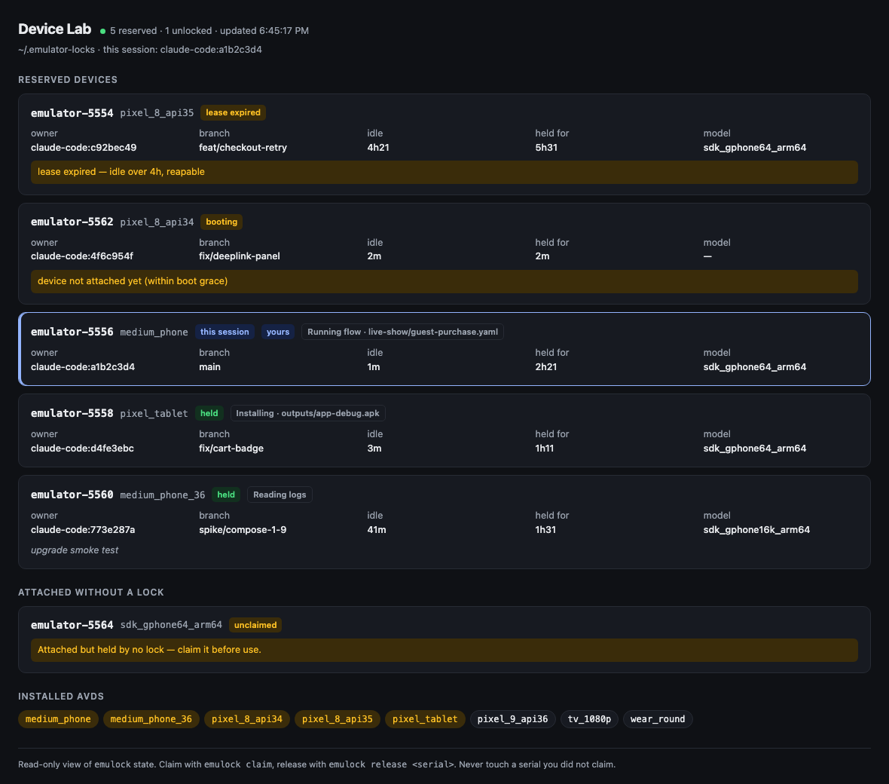
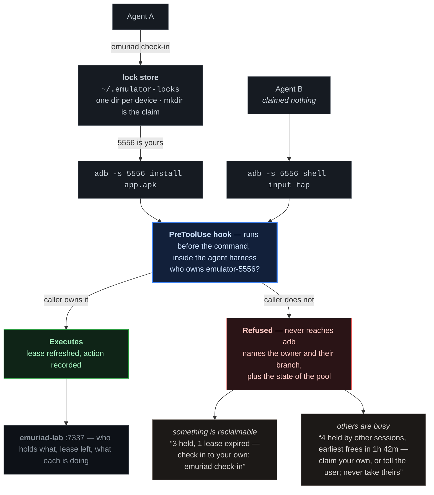

# emuriad

**Stop parallel coding agents from fighting over the same Android emulator.**



## The problem

You run three or four coding agents at once, because that is the whole point of agents.
They all share one machine, they all run `adb devices`, and they all see the same list.
Nothing tells any of them that a device is spoken for.

So this happens:

- **Agent A installs its APK onto the emulator Agent B is testing on.** B's next
  assertion fails against a build it never made. B concludes its code is broken, and
  spends the next twenty minutes proving something that was never true.
- **Agent C runs `adb kill-server`** to clear up a connection glitch. It drops *every*
  session's devices at once. Three unrelated tasks fail simultaneously.
- **Agent D reboots a device** mid-suite. The run dies at flow 7 of 12 with an error
  that looks exactly like a flaky test.
- **A device crashes, and an agent re-runs a remembered `emulator -port 5554`.** That
  port now hosts a completely different AVD. Everything passes — against the wrong API
  level.
- **An agent finishes and never releases.** Hours later a lock is still held by a
  session that ended long ago, and the pool is full of devices nobody is using.

Every one of these is invisible in the logs. You do not see a collision; you see a
flaky test, a broken build, a wasted afternoon. And the more agents you run, the worse
it gets — which punishes exactly the thing you were trying to do.

## The fix

Every device is reserved before use, and **the reservation is enforced by the harness,
not by the agent's good manners**:

```
$ emuriad check-in
emulator-5556  (AVD: medium_phone)  claimed by claude-code:15db96f9

$ adb -s emulator-5560 shell input tap 100 200
Blocked: emulator-5560 belongs to another agent (branch: fix/checkout-flake).
Never touch a device you didn't check in to. Check in to your own with: emuriad check-in
```

That is not a warning the agent can read and ignore. The command never runs.

## How it works



The hook is the whole trick. It sits in the agent harness — not in a wrapper script the
agent could sidestep, not in a linter it could ignore — so a device-stomping command is
stopped before it ever reaches `adb`.

A refusal is the one message an agent reads at the exact moment it needs direction, so it
carries what the lock store knows: how many devices other sessions hold, how many leases
have expired and are reclaimable now, and when the next one frees — and it always ends in
the one correct move, `emuriad check-in`. The hook cannot see which emulators are running or
which AVDs are free (that takes adb, which it never starts), so it never declares the
machine full; `claim` does, and then the message is **tell the user**, never "take one".
A generic "claim a device first" leaves an agent guessing, and a guessing agent retries in
a loop.

It reports a count, never a specific serial: two agents refused in the same instant would
both be sent after the same device, and one would lose a race it had just been promised.
`emuriad check-in` does the atomic tie-break itself.

The failures above stop being possible:

| Failure | What stops it |
|---|---|
| Installing onto someone else's device | the command is refused before it executes |
| `adb kill-server` | always refused, for everyone |
| Bare `adb shell` picking a device at random | refused; you must name your own serial |
| Booting the wrong AVD on a recycled port | a launch must use the port *and* AVD you reserved |
| `./gradlew installDebug` hitting every connected device | refused unless `ANDROID_SERIAL` names your own device |
| A device still carrying the last agent's state | pool instances start from a snapshot and are shut down on release |
| Testing the wrong build | `emuriad doctor` checks the installed APK is your checkout's |
| Locks outliving the session | leases expire after 4h idle and are reclaimable |
| Not knowing who holds what | `emuriad status`, or a live dashboard |

## A lock an agent can't route around

Reservation schemes usually ask for cooperation: the agent is supposed to check first.
Agents shell out constantly, and a device-stomping command looks completely reasonable
in isolation — so eventually one skips the check and the reservation means nothing.

emuriad installs a `PreToolUse` hook. The harness refuses the command before it
executes. The lock stops being a convention and becomes a boundary.

Two halves make that work:

- **The hook** refuses what it should refuse, with a message that names the owner and
  the branch, so the agent knows what happened instead of guessing.
- **The skill** teaches the protocol up front, so agents claim correctly and rarely hit
  the hook at all. Enforcement is the floor, not the interface.

Android only, deliberately. Android emulators are heavyweight VMs bound to a port —
you run a handful before the machine gives out, and two sessions booting the same AVD
corrupt the image. That scarcity is what makes locking worth enforcing.

**No daemon, no database.** Bash, python3, `jq`, and the platform-tools you already have.

## Install

Requires `bash`, `jq`, `python3`, and the Android SDK platform-tools. macOS and Linux.

```bash
brew install boukhariayoub/emuriad/emuriad
emuriad init
```

`init` does two things, and shows each change before making it:

1. links the **skill** into `~/.claude/skills/emuriad`, so agents learn the protocol
   up front instead of by being refused;
2. adds the **guard** to `~/.claude/settings.json` as a `PreToolUse` hook, so every
   project on the machine is covered. It asks first, and without a terminal it prints
   the change and stops: a hook decides which commands an agent may run, so wiring it
   is a step for a person, not for an agent.

For a team, `emuriad init --project` writes the hook and a copy of the skill into the
repo's `.claude/` instead; commit them and every contributor who has emuriad
installed is covered. Nothing else is needed per project.

Without Homebrew: `git clone https://github.com/BoukhariAyoub/emuriad.git && cd emuriad && ./install.sh`,
then `emuriad init`.

Verify:

```bash
emuriad doctor          # is emuriad installed, and is enforcement actually wired up?
./tests/run.sh          # the suite, no dependencies
```

> **`jq` is not optional.** The guard parses the harness payload with it, and a hook
> that cannot parse its input exits 0 — which means *allow*. Without `jq`, `claim` and
> `status` still work and **nothing is enforced, silently.** It can't fail closed
> instead: a hook that denied on its own breakage would block every shell command on
> the machine with no way to repair it. Homebrew installs `jq` with emuriad;
> `emuriad doctor` checks for it either way.

### Renamed from emulock

emuriad was called **emulock** before 0.3. Nothing you set up then stops working:

- `emulock` and `emulock-lab` are still installed, as shims that print a one-line
  notice and run `emuriad`. `emulock guard` stays silent, so a hook wired to it keeps
  enforcing without noise. So does a settings file pointing at `emulock-guard.sh`.
- The lock store (`~/.emulator-locks/`) and every `EMULATOR_*` variable are unchanged,
  so existing locks carry over.
- A project's `.emulock/` directory is still read when there is no `.emuriad/`, and
  `EMULOCK_<KEY>` still overrides a key when `EMURIAD_<KEY>` is unset. A doctor plugin
  that imports `emulock_doctor` still loads. A pool AVD baked as `emulock-pool` is
  still a pool AVD, and the default pool AVD name stays `emulock_pool`.

To move over:

```bash
brew uninstall emulock && brew untap boukhariayoub/emulock
brew install boukhariayoub/emuriad/emuriad
emuriad init            # finds the old hook and skill, shows the change, asks first
git mv .emulock .emuriad   # in each project, when convenient
```

The shims go away in a later release.

## Use

```bash
emuriad check-in --pool               # a disposable, ready-made device (see "The pool")
emuriad check-in --pool --window      # the same, in a window you can watch
emuriad check-in                      # or reserve an ordinary AVD
emuriad check-in --avd medium_phone   # a specific one
emuriad check-in --note "checkout flake repro"
emuriad doctor emulator-5556          # is this device ready to test on?
emuriad status                        # who owns what
emuriad extend-stay emulator-5556     # keep it through a long silent stretch
emuriad reclaim                       # device died — same AVD (or a fresh pool instance)
emuriad check-out emulator-5556       # done
emuriad reap                          # clear provably dead locks
```

`claim`, `release` and `heartbeat` — the names before 0.3.1 — still work, as the
same commands as `check-in`, `check-out` and `extend-stay`.

Always target your own serial explicitly — `adb -s <your-serial> …`, never bare
`adb shell`. Gradle's `install*`/`connected*` tasks need it inline:
`ANDROID_SERIAL=emulator-5556 ./gradlew installDebug`. Every allowed device command
refreshes your lease.

### Identity is the AVD, not the port

`emulator-5554` is the serial that bound port 5554 *this boot*. Next boot it may be a
different AVD entirely. After a crash use `emuriad reclaim`, never a remembered
`-port 5554` command — that port may now be something else.

### The pool

An ordinary AVD carries whatever the last session left on it. A pool instance does not:
`emuriad check-in --pool` boots a read-only copy of one AVD from its `golden` snapshot, so
every instance starts identical, and releasing it shuts it down so nothing you changed
reaches the next agent. Booting from the snapshot takes seconds.

```bash
emuriad pool bake                  # build golden once (3–5 min)
emuriad pool rebake                # weekly: bake from a fresh build of main, in a throwaway checkout
emuriad pool status
```

`bake` fixes the settings that waste agent time on a fresh device — Private DNS off
(it breaks name resolution on the emulator's network), animations off (kept on for the
`--window` snapshot, which a person watches: a frozen spinner reads as a hang), screen always
on, no lock screen, a hardware keyboard so the IME never covers the screen — then
installs your app and runs your project's setup hook if you have one (below). It only
saves the snapshot if `emuriad doctor` agrees the device is clean.

**Headless by default, watchable on request.** A snapshot loads only under the display
setup it was saved with — the renderer *and* the window — and a boot that cannot load
it makes the emulator delete it, for every agent. So a device you can watch has its
own snapshot:

```bash
emuriad pool bake --window         # once: saves golden-window from a windowed boot
emuriad check-in --pool --window      # a disposable pool instance, in a window
```

The guard holds each boot to its snapshot — `golden` needs `-no-window`,
`golden-window` must not have it, and neither takes a `-gpu` flag — and both are
read-only on disk between bakes. `rebake` refreshes `golden-window` too once it exists.

### Proof for reviewers

```bash
emuriad evidence start emulator-5556 --label "PROJ-123 cart badge"
emuriad evidence shot  emulator-5556 "cart shows 2 items"
emuriad evidence note  emulator-5556 "tapped Add twice, badge went 1 → 2"
emuriad evidence stop  emulator-5556
```

A screen recording in 3-minute parts, labelled screenshots, notes, the crash buffer,
recent warnings, and the doctor's report before and after — including whether the
installed build is the one in your checkout. `stop` writes `summary.md` and a
`manifest.json` of files to upload; `render` fills their URLs into the summary. It all
lands in `.evidence/` in your repo (keep it gitignored; `start` warns if it is not).

## Project config

Nothing is required. A project that wants more adds `.emuriad/` at its root:

```
.emuriad/
  config            key = value settings, below
  pool-setup.sh     run on the device during `pool bake`: sign-in state, first-run flags, permissions
  doctor.py         extra checks for `emuriad doctor`: def checks(device, ctx) -> [Check]
```

```ini
# .emuriad/config
package          = com.example.app.debug       # app the doctor and evidence look at
package.release  = com.example.app             # variants: `emuriad doctor <serial> release`
apk.glob         = app/build/outputs/apk/*/*/*.apk
build.command    = ./gradlew :app:assembleDebug
locale           = en-US                       # "any" to skip the check
pool.avd         = myapp_pool
pool.apk         = app/build/outputs/apk/debug/app-debug.apk
pool.build       = ./gradlew :app:assembleDebug
pool.verify      = lock boot dns locale notifications on-top
```

Any key can be overridden from the environment: `pool.avd` is `EMURIAD_POOL_AVD`.
`emuriad pool --help` and `emuriad doctor --help` list every key.

`pool-setup.sh` and `doctor.py` are your repo's own code, run only when you run
`pool bake` or `doctor` in that repo (`--no-project` skips the plugin). The guard never
reads project files: it runs before every shell command, and a hook that executed a
repo's scripts would run them in every project you open.

## emuriad-lab

```bash
emuriad-lab
```

A read-only dashboard on `127.0.0.1:7337`. It enumerates the lock store, asks adb what
is actually attached, and lists installed AVDs. It never claims, releases, boots or
targets a device, so it is safe to leave open beside any number of live agent sessions.

Each device resolves to one state, and **live observation always beats stored metadata**:

| State | Meaning |
|---|---|
| `no lock` | running, owned by nobody — anyone's next command can take it |
| `ghost` | the device died but the lock outlived it |
| `expired` | lease ran out; reclaimable right now |
| `yours` | this session owns it |
| `booting` | claimed, not yet attached (`stalled` past 3 minutes) |
| `held` | another session, healthy |

It also shows **what each session is doing** — `Running flow · checkout.yaml`,
`Installing`, `Driving UI` — classified from the command the guard already intercepts.

## What gets stored

One directory per device under `~/.emulator-locks`, plus one per AVD so two claims can
never boot the same image. `mkdir` is the atomic claim; there is no daemon and no
database.

Activity is recorded as a fixed verb plus one narrowly-extracted target
(`Running flow`, `live-show/checkout.yaml`). **The command itself is never written to
disk** — the lock store is world-readable on a shared machine, and command lines carry
paths, hostnames and arguments that have no business sitting in it.

Nothing here reads your repo's layout, your tracker's id format, or any particular
agent's files. Branch comes from git; the verb comes from the command; the note is
whatever you passed to `claim --note`. A project with none of those conventions still
gets a useful dashboard.

## Environment

| Variable | Default | Meaning |
|---|---|---|
| `EMULATOR_LOCK_DIR` | `~/.emulator-locks` | lock store location |
| `EMULATOR_LOCK_IDLE_TTL` | `14400` (4h) | lease length before a lock is reclaimable |
| `EMULATOR_LOCK_OWNER` | unset | override session identity (for other harnesses) |
| `EMULATOR_LOCK_TICKET_RE` | unset | regex whose first group is a ticket id in the branch name; unset shows no ticket |
| `ANDROID_HOME` / `ANDROID_SDK_ROOT` | probed | SDK root |
| `ANDROID_AVD_HOME` | `~/.android/avd` | AVD directory |
| `EMURIAD_<KEY>` | unset | overrides a `.emuriad/config` key (see Project config); the pre-0.3 `EMULOCK_<KEY>` still works |

## Harness support

**Claude Code** is enforced — it exposes a stable per-session id in the shell
environment, so the guard and the CLI always agree on who "this session" is.

Anything else (a bare terminal, another agent runner) falls back to
`manual:$USER` and is **advisory only**: the locks still coordinate, but nothing
blocks a command. Set `EMULATOR_LOCK_OWNER` to give an external driver a stable
identity.

The guard inspects only the top-level command string. A wrapper script that shells out
to adb internally is not policed and is expected to claim for itself. Quoted strings and
heredocs are stripped before matching, so a commit message mentioning `adb` does not trip
enforcement — which also means `bash -c "adb …"` escapes inspection. **This is
anti-accident, not anti-adversarial.**

## Tests

```bash
./tests/run.sh          # all
./tests/run.sh guard    # one group: shells | guard | state | lock | py
```

No dependencies beyond python3, run against a scratch lock store, AVD home and HOME —
safe to run while agents hold live devices.

The guard is a `PreToolUse` hook on *every* shell command, so a syntax error in it does
not merely break adb: it blocks all shell access for every session on the machine, and
agents cannot repair it because editing hooks counts as self-modification. The suite
therefore parses it under the oldest bash it must run on (macOS ships 3.2) as well as
your current one. **Run the tests before you edit the hook.**

## License

MIT
